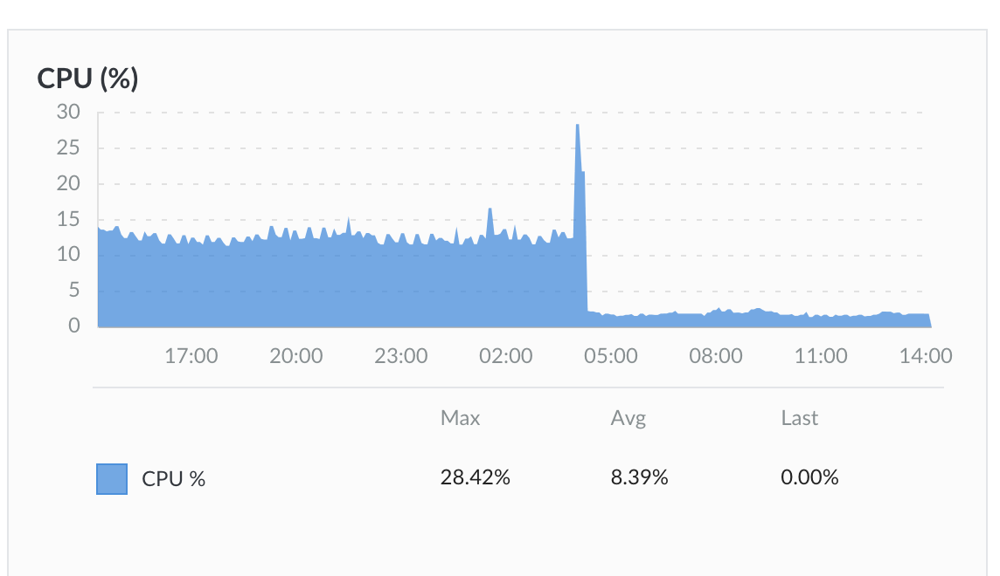

# How to Avoid Moving to Kubernetes on a Hobby Website

SUSE sponsors a hack week about once a year, where we employees get to scratch whatever technical itch we might have[1].
This past winter I had too much of a work backlog and not much itch, so I didn't participate, but then the weekend after
week hack I got struck with an idea, the details of which I'll get to real soon, but the important part of this article
is this image that I saw on my personal cloud dashboard about two months later:


I've had my own personal Linode VM server for a long time. Maybe because I remember back in 1999 buying a used 386 PC, installing a locally-sourced
distro on it (Ottawa's own Achilles distro, so if I had questions the maintainer was a local call away), and paying about $20/month
to park it in a long-since defunct ISP's colocation lab. There are cheaper ways to do it now,
but paying $5/month for your own shell on a VM in the cloud is ok for me. I would park most of my hack week projects there, as well as other
hackathon-type experiments, where they would continue to languish in obscurity.  The CPU usage would rarely climb above 1%.
Disk I/O would similarily rarely climb over 1 block/sec.

Meanwhile professionally I've been working on tools to help people use Kubernetes or other container-management systems.
This is great technology, but I figured it was overkill for my latest hobby project. That was great if people found it interesting,
but I didn't want it to take up much of my time or money. The last thing I need to do is spend an hour every morning managing
my own deployment before heading to work to work on others' deployments.

My project was actually a dirt simple concept, based on the Wordle puzzle[2]: Guess a five-letter word, and each square is colored based on whether the letter is
in the correct position, elsewhere in the word, or not in the word. Except one of the letters in each answer will be colored incorrectly[3]. Since I had saved the 
wordlists used in the original Wordle game (see footnote #3), it took a few minutes to write up a Ruby command-line app, that answered "1", "2" or "3" instead
of "black", "yellow", or "green". I found the puzzle challenging, but the exercise would have ended there, if a search hadn't led me to a Wordle Construction Kit.
Essentially I just had to download the code in the article and add a 4-line JavaScript function to perturb the answer before coloring the squares.

I showed it to my Philosophy BA daughter. She loved it, and asked if I could put it on the web so she didn't have to rely on a daily zoom session to play it.

The name `lirdle.com` was available, and was adequate to capture the combination of "lying" and "wordle". It wasn't perfect, but there aren't many pronounceable English terms still available in the .com TLD. I even thought of "lrdle.com" which is five letters long, but opted for pronounceability. It's still available if anyone reading this wants it.

Putting it on the web was trivial. But then I wondered what if someone had put in say 10 guesses and the cat jumped on their keyboard and accidentally closed the tab? Adding state took up much of another Saturday. And as long as I was keeping track of one's guesses, I might as well add stats as well. And in the spirit of 
making this a client-side app and not having to do any server maintenance, everything was stored in the browser's `localStorage` - no need to deal with 
GDPR requirements or even find a Cookie acceptance panel somewhere. 

On Feb. 22, 2023, I announced
the project at https://projects.metafilter.com/6152/Lirdle-Like-Wordle-but-with-one-lie-per-answer, 
and 3 days later a newsletter I had never heard of,
 "Morning Brew", mentioned it and about 20,000 people visited lirdle.com that day.

If you glance back at the graph, you won't see that date in the graph. The CPU usage was a steady 1%, and on Feb. 25 it spiked all the way up to 5%,
just for that day. The Disk I/O barely moved. I don't know the architecture of Nginx, but if it caches static files (and that's all Lirdle consists of) 
with a certain TTL, it didn't need to hit the disk that often.

The problem began with those 20,000 different IP addresses that hit the site: I had no idea how many people were playing the game. I did see someone
on Facebook complain that they had no idea what to do on the site (it looks exactly like Wordle with a big header stating "One Lie Per Line", but
there was no help document then). Then I'd want to know who went from landing on the page, and then either starting to play until they finished,
or reading the help document. But I still didn't want to write a server app and deal with database management as well as increasing the hackable surface of my server.

My solution was to add a `GET /usage 204` endpoint to the app. Then any requests for `/usage` would return a `204 No Content` result to the user's client,
and I could write a quick ruby script to analyze `access.log` and build up the stats.

The web site always shows the stats for the previous day. Once the current day's word is worked out (oh yeah, Lirdle doesn't have end after some predetermined 
number of lines, because that would mitigate the annoyance factor), users see some text like this:


The two lines of stats come from making `fetch` requests to the server for the files `stats/dayNNNN.json` where `N` is based on the number of the puzzle. In the above example, the results for yesterday's word came from "day0056.json", and today's "day0057.json". That day #57 is particularly hard -- "mambo" if you were wondering.

You might think this is more digressing, but we're moving right to that graph at the start of this document. Once the app launched, game `#X` would 
start at midnight localtime. So this meant while eager people in New Zealand were playing say game #58 just after midnight their time, some laggards in Hawaii might be 
just starting on game #57. I just decided to write a Ruby script that went through `access.log`, pulling out each `GET /usage` line, doing a few calculations,
and generating a JSON file. The script runs every minute to keep the stats files updated. It only took a second to run; I figured there wouldn't be any problem.

And as that file got increasingly bigger, it took Ruby progressively longer to do all that processing. I could have done all this with
`grep` and `awk`, but my main reason for using Ruby was that its
Date class has a `Date#jd` method that makes it easy for me convert the current actual date to the date number Lirdle uses internally.

So I tried putting `grep` before the Ruby code to find the dates I cared about, and the runtime dropped from around a second to about 5 msec, but I was
still concerned about the `O(n)` nature of the problem.

I could rotate the logs, but I'm now treating that access.log file as my database, and the longer I can go without having to rotate it, the better.
All in the spirit of doing as little as necessary on a hobby project.

But I had one more idea for a weekend project: if I'm going to try to rotate the logs as seldom as possible, what if I create an index file that
shows where the logs for each date start in the access file, and just jump to that point and emit only the necessary lines?

So now I have a small JSON file with these entries:
```
{
  "offsetsByDateNum": { "58": 197089436, "57": 195293713, ... },
  "firstLine": "A.B.C.D - - [23/Feb/2023:03:44:32 -0800] "POST /.env HTTP/1.1" 404..."
}
```

Now the log file processor checks the first line to verify that the file hasn't been rotated. In this case, if it wants to generate
the stats for day 58, it does an `f.seek` to position `197,089,436` of the file and just does output from there (where `f` is the input file's file descriptor).
I need to keep going to the end to discover all the `unfinished` games for that day; for example, some users might stop trying on day 58, then give the app a try
on day 61, and there will be line in access.log reporting `GET /usage/unfinished?date=61&from=58&count=8`.

So the Ruby script was replaced with this pipeline:

`ruby cull.rb -d 58 -p positions.json access.log | grep '\<day=58' | ruby process.rb > day0058.json`

The runtime for this was about 3 msec (down from about a second), and there's some other optimizations I could make later if I have to.

The dashboard screenshots now look much better. The day after I implemented this fix:



and the Disk I/O became negligible:


The last time I used `File#seek` (and `File#.pos` to find the location) was... never. I read about them in an
introductory Operating Systems course, but the code we wrote in that course focused on process schedule algorithms
and device drivers -- we still took the file system for granted. What I've
done is basically implement a region-based database inside a flatfile, with a separate index file to find where certain
things are found instantly.  It could be the start of another project. But for now the app is running itself. About 3-400
people every day have stuck around from that early hit of 20,000 to play the game every day. There's now a help file
that I hope will make the next crowd of visitors that arrive off a newsletter feel a little more welcome, and then if
my math is right, my server can deal with about 500,000 daily players before I start looking at pushing it into the 
wider world of containers, synchronization, real databases, and app servers.

[1] Or even non-technical — I know of someone who thought he could learn German during a hack week; I don't know how well that went,
but speaking as someone who is now on year 5 of learning the language, I don't think you could learn much more than how to
order a beer and sausage at a Munich restaurant, and even then you won't get the grammar right.

[2] Which itself is a word-based variant of the Mastermind game from the 1970s:
determine the five-letter word in six guesses, where correct letters are marked green, incorrect letters black, and letters that are elsewhere in the word are yellow.
Now I had the original word lists from Wordle because the game went viral just when I was getting over a mild case of Covid-19. The original game was a SPA
(Single-Page Application) HTML page with two lists of words, one with about 2300 words, and the other with around 10,500. The first list contained candidate words,
while the second contained more obscure words that could be used in a guess, but would never actually be the word of the day. Maybe I couldn't do
actual work while getting over Covid, but I could write a 12-line ruby script to determine that the best first guess was `ORATE`, which for some reason
was in the secondary list. The second guess would normally be `LINDS`. It's not even in our well-worn Scrabble dictionary here, but Wordle still accepts it and I still use it.

[3] The inspiration comes from an unforgettable game of Clue with a nephew, who decided the game would be more interesting if he denied having a particular card.
